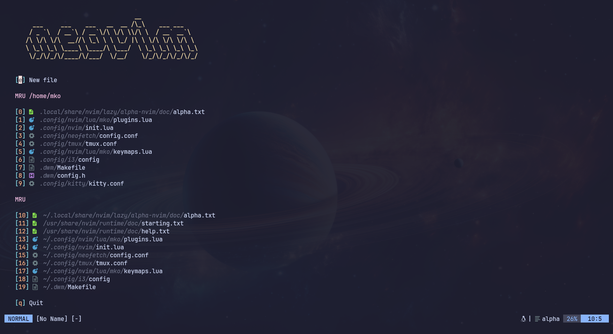
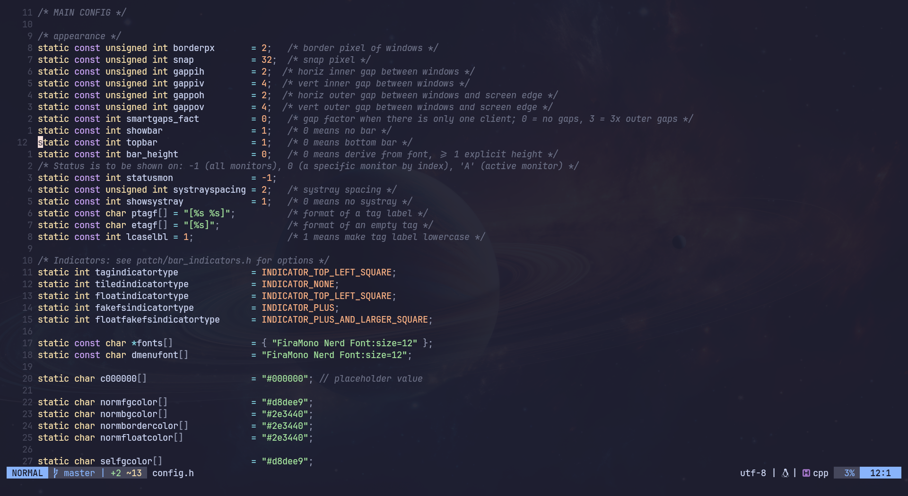

# nvim-mko

My Neovim Configuration




## Installation

```bash
git clone https://github.com/gitmko/nvim-mko $HOME/.config/nvim && nvim
```

## Plugin list

- [VonHeikemen/lsp-zero.nvim](https://github.com/VonHeikemen/lsp-zero.nvim)
- [nvim-telescope/telescope.nvim](https://github.com/nvim-telescope/telescope.nvim)
- [nvim-treesitter/nvim-treesitter](https://github.com/nvim-treesitter/nvim-treesitter)
- [catppuccin/nvim](https://github.com/catppuccin/nvim)
- [nvim-lualine/lualine.nvim](https://github.com/nvim-lualine/lualine.nvim)
- [folke/which-key.nvim](https://github.com/folke/which-key.nvim)
- [goolord/alpha-nvim](https://github.com/goolord/alpha-nvim)
- [tpope/vim-fugitive](https://github.com/tpope/vim-fugitive/)
- [iamcco/markdown-preview.nvim](https://github.com/iamcco/markdown-preview.nvim)
- [akinsho/toggleterm.nvim](https://github.com/akinsho/toggleterm.nvim)
